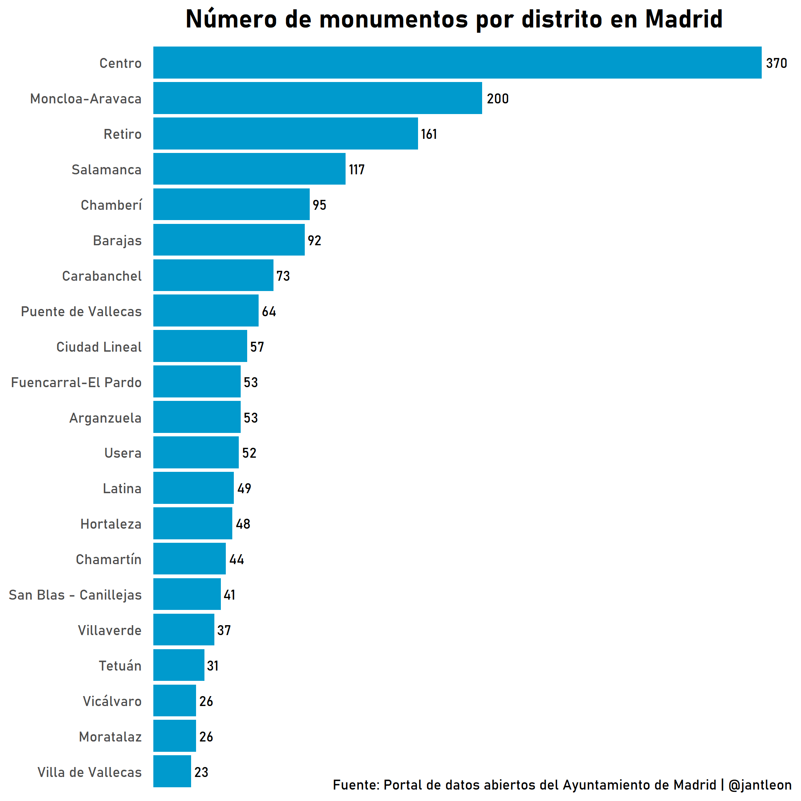
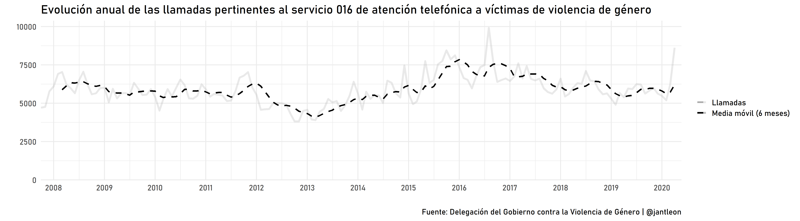
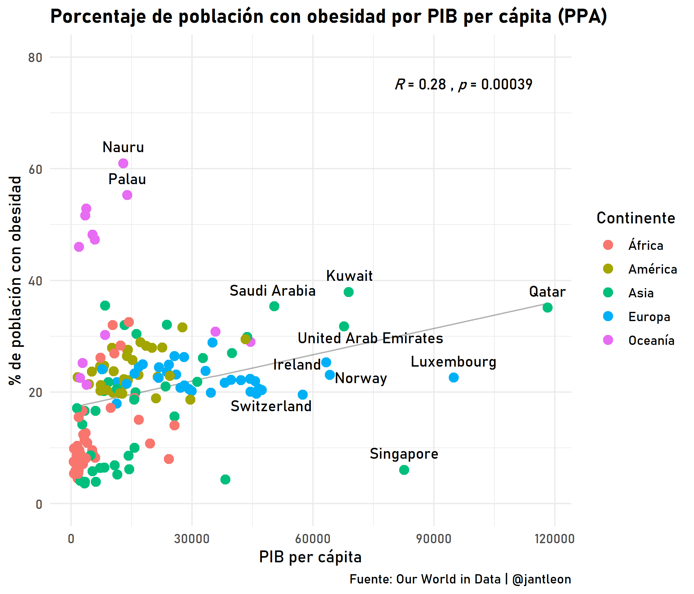
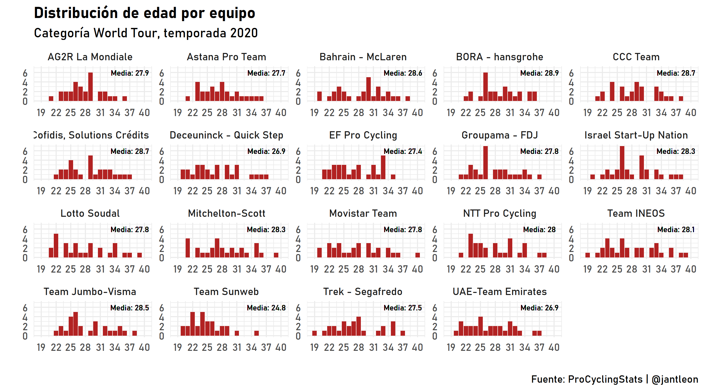
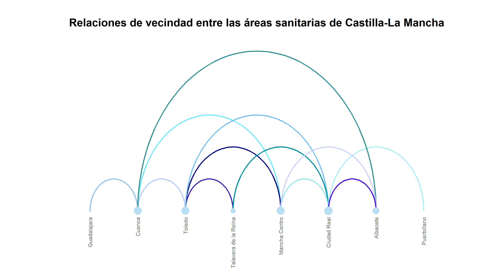
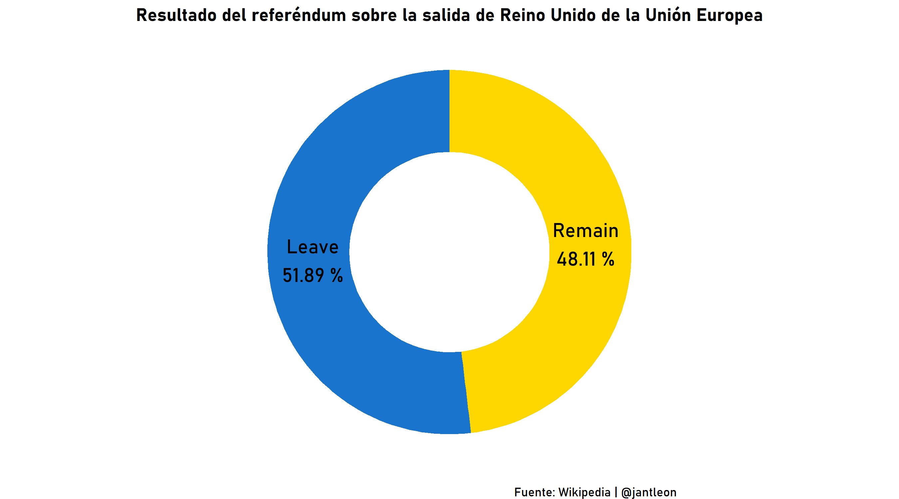
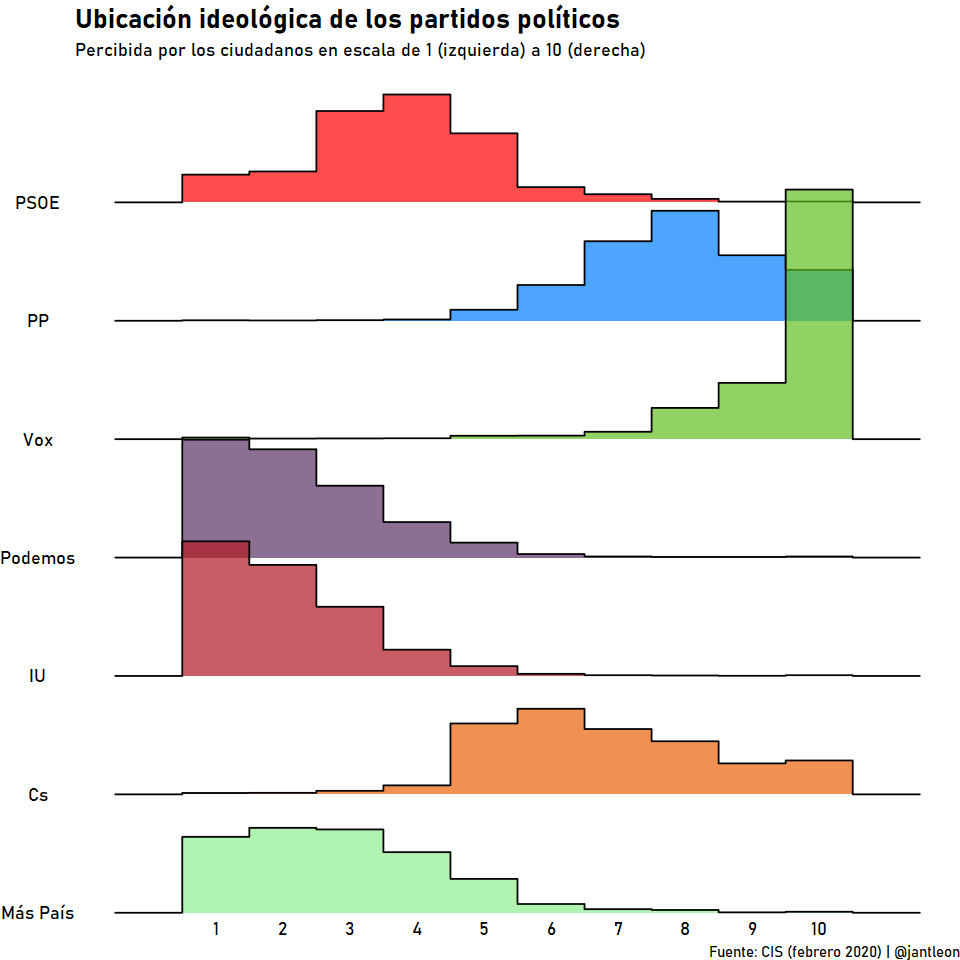
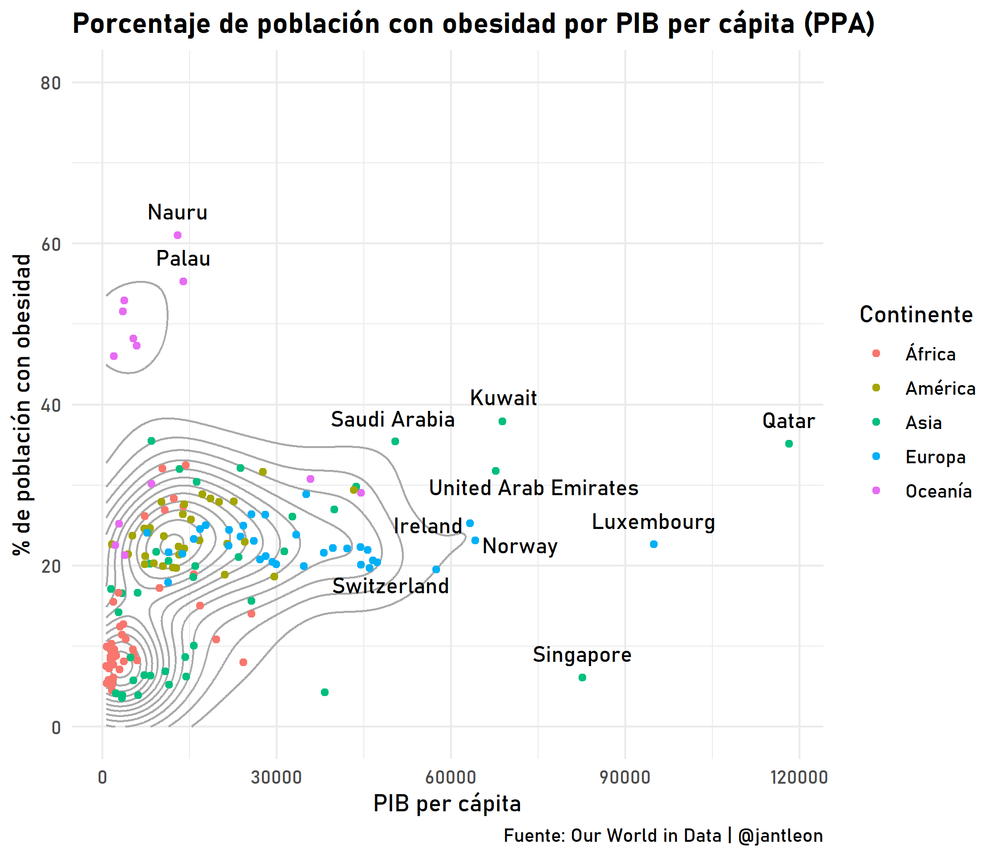
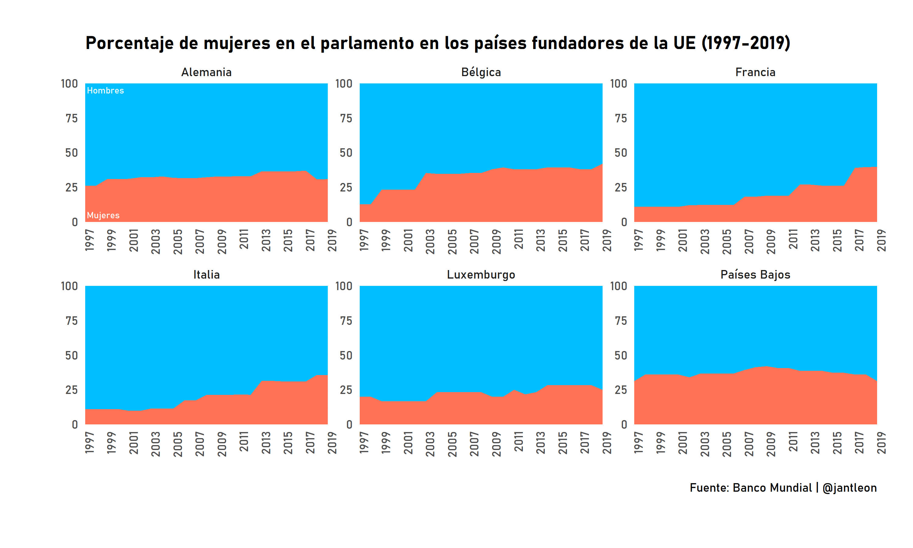

Desde R para Ciencia de Datos han comenzado el reto de compartir un gráfico hecho con R cada día a partir del 12 de mayo. Como el objetivo de esta iniciativa es aprender sobre visualización de datos y ese es uno de mis objetivos actualmente, me voy a sumar al reto. Esta comunidad propone hashtags habitualmente en Twitter para concentrar visualizaciones y fomentar que los usuarios compartan sus gráficos. Aunque la actividad en Twitter de este perfil es muy interesante, su mayor aportación es la traducción del libro R para Ciencia de Datos, del creador de Tidyverse Hadley Wickham. Esta biblia se puede consultar en el siguiente enlace <https://es.r4ds.hadley.nz/>.

Para #30diasdegraficos se ha establecido el siguiente calendario:
 

Con este reto quiero poner en práctica mis habilidades con Tidyverse y, especialmente, con ggplot2, un must para para visualización de datos. ¡Allá vamos!

**Día 1: Gráfico de barras con datos de la API REST del Ayuntamiento de Madrid**

**Día 2: Gráfico de líneas con la evolución de las llamadas al 016 y media móvil**

**Día 3: Gráfico de dispersión de porcentaje de obesidad por renta per cápita con inner join de tres tablas de datos**

**Día 4: Distribución de edad por equipo World Tour en la temporada 2020 (con facets y web scraping)**

**Día 5: Diagrama de arco con las relaciones de vecindad de las áreas sanitarias de Castilla-La Mancha**

**Día 6: Gráfico de donut con resultado del referéndum de salida del Reino Unido de la Unión Europea (web scraping de tablas de Wikipedia)**

**Día 7: Gráfico ridgeline con ubicación de los partidos políticos percibida por los ciudadanos**

**Día 8: Gráfico de densidad sobre porcentaje de población con obesidad por PIB per capita**

**Día 9: Gráfico de áreas apiladas sobre mujeres en el parlamento en los países fundadores de la UE (1997-2019)**

