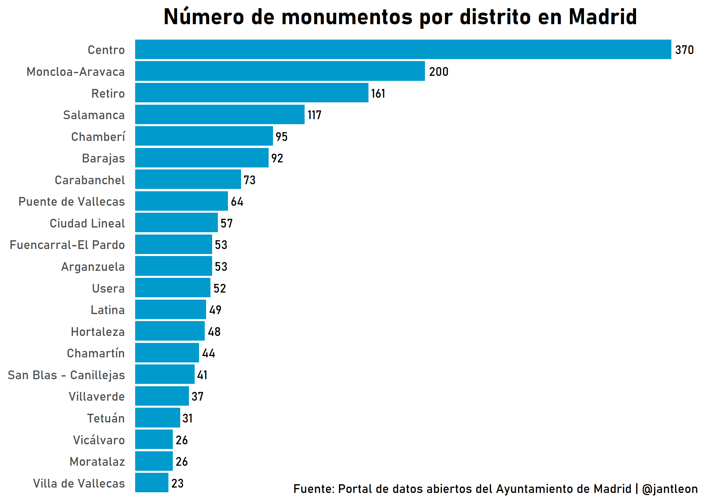
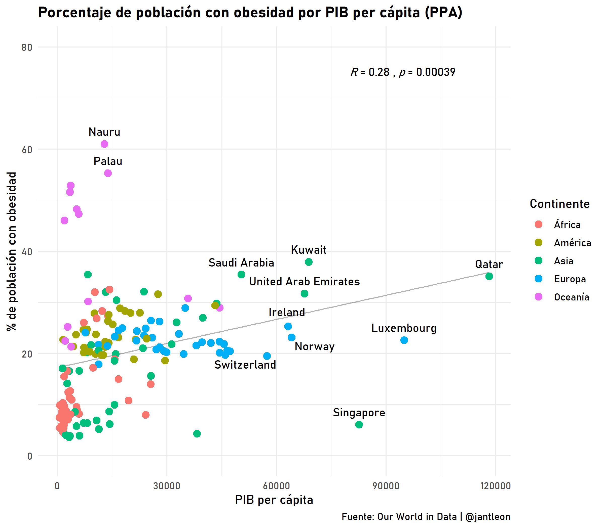

Desde R para Ciencia de Datos han comenzado el reto de compartir un gráfico hecho con R cada día a partir del 12 de mayo. Como el objetivo de esta iniciativa es aprender sobre visualización de datos y ese es uno de mis objetivos actualmente, me voy a sumar al reto. Esta comunidad propone hashtags habitualmente en Twitter para concentrar visualizaciones y fomentar que los usuarios compartan sus gráficos. Aunque la actividad en Twitter de este perfil es muy interesante, su mayor aportación es la traducción del libro R para Ciencia de Datos, del creador de Tidyverse Hadley Wickham. Esta biblia se puede consultar en el siguiente enlace <https://es.r4ds.hadley.nz/>.

Para #30diasdegraficos se ha establecido el siguiente calendario:
 

Con este reto quiero poner en práctica mis habilidades con Tidyverse y, especialmente, con ggplot2, un must para para visualización de datos. ¡Allá vamos!

**Día 1: Gráfico de barras con datos de la API REST del Ayuntamiento de Madrid**

**Día 2: Gráfico de líneas con la evolución de las llamadas al 016 y media móvil**

**Día 3: Gráfico de dispersión con inner join de tres tablas de datos**

